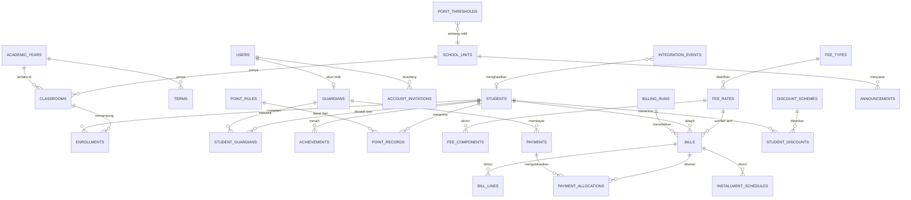

# 03 — ERD / Skema Database

PostgreSQL 17. Semua tabel memakai `id bigint PK` internal **dan** `ulid` unik yang
dipakai sebagai route key — ID numerik tidak pernah keluar ke API/URL.

Konvensi yang diikuti dari PMB: FK selalu `->constrained()` dengan
`cascadeOnDelete()`/`nullOnDelete()` sesuai semantik, PII terenkripsi + kolom
`*_hash` HMAC-SHA256 untuk unique/lookup, uang selalu `decimal(12,2)`.

## Peta domain

---

## A. Auth & organisasi

### `users`
| Kolom | Tipe | Catatan |
|---|---|---|
| id, ulid | bigint PK, string unique | |
| name, email (unique), password | string | password nullable sampai akun diaktivasi |
| role | enum(admin, admin_unit, guru, orangtua) | |
| school_unit_id | FK → school_units, nullable | wajib untuk `admin_unit` dan `guru` |
| phone, phone_hash | string enc / string(64) index | login alternatif untuk wali tanpa email |
| is_active | boolean default true | |
| activated_at | timestamp nullable | terisi saat undangan dipakai |
| last_login_at, email_verified_at, remember_token, timestamps | | |

Unique parsial: `email` unique bila tidak null; `phone_hash` unique bila tidak null.
Wali murid boleh punya salah satu saja.

### `school_units`
Cerminan tabel yang sama di PMB, disinkron manual/seed. Kolom: `id, ulid, code (unique),
label, jenjang_group, sort_order, is_active, timestamps`.

`code` (mis. `SD-SAKINAH`) adalah kunci yang dipakai payload handoff — bukan `label`,
supaya perubahan penamaan di PMB tidak memutus integrasi. Ini memperbaiki kelemahan
PMB yang mencocokkan unit lewat teks bebas (`SchoolUnit::matching()`).

### `academic_years`
`id, ulid, year (unique, mis. "2026/2027"), starts_on, ends_on, is_active (boolean), timestamps`.
Hanya satu boleh `is_active` — ditegakkan unique partial index `WHERE is_active`.

### `terms`
`id, ulid, academic_year_id FK, name enum(ganjil, genap), starts_on, ends_on, is_active`.
Unique `(academic_year_id, name)`. Dipakai sebagai periode reset poin dan periode buku.

### `classrooms` (rombel)
| Kolom | Tipe | Catatan |
|---|---|---|
| id, ulid | | |
| school_unit_id, academic_year_id | FK | |
| tingkat | smallint | 1–6 SD, 7–9 SMP, dst. |
| name | string | "1A", "7 Ibnu Sina" |
| homeroom_teacher_id | FK → users, nullable | wali kelas |
| capacity | smallint nullable | |
| is_active, timestamps | | |

Unique `(academic_year_id, school_unit_id, name)`.

### `staff_profiles`
`id, ulid, user_id FK unique, nip nullable, jabatan, phone (enc), photo_path, timestamps`.
Data guru/staf yang tidak layak ditaruh di `users`.

---

## B. Siswa & wali

### `students`
| Kolom | Tipe | Catatan |
|---|---|---|
| id, ulid | | |
| pmb_student_ulid | string unique nullable | jejak ke PMB; NULL untuk siswa pindahan |
| no_pendaftaran | string nullable | referensi historis PMB |
| nis | string unique nullable | nomor induk sekolah, terbit saat status jadi `active` |
| nisn, nisn_hash | enc / string(64) unique nullable | |
| nik, nik_hash | enc / string(64) unique nullable | |
| nama_lengkap, nama_panggilan | string | |
| jenis_kelamin | enum(L, P) | |
| tempat_lahir, tanggal_lahir | string, date | |
| agama, kewarganegaraan, golongan_darah | string nullable | |
| alamat_lengkap, rt, rw, kelurahan, kecamatan, kota_kabupaten, provinsi, kode_pos | | |
| school_unit_id | FK | unit tempat siswa bersekolah |
| entry_year_id | FK → academic_years | tahun masuk |
| status | enum(prospective, active, graduated, transferred, dropped_out) default prospective | handoff PMB langsung membuat `active`; `prospective` untuk siswa pindahan yang diinput manual (D1) |
| status_notes, status_changed_at | text, timestamp | |
| photo_path | string nullable | |
| timestamps, softDeletes | | |

Index: `status`, `school_unit_id`, `(school_unit_id, status)`.

### `guardians`
`id, ulid, user_id FK unique nullable, nama, hubungan enum(ayah, ibu, wali),
no_hp (enc) + no_hp_hash (index), email nullable, pekerjaan, penghasilan_bulanan
nullable, alamat, timestamps`.

`user_id` nullable karena tidak semua wali punya akun (mis. ayah punya akun, ibu tidak).

### `student_guardians`
`id, student_id FK, guardian_id FK, relationship enum, is_primary boolean,
is_billing_contact boolean, timestamps`. Unique `(student_id, guardian_id)`.

Tabel inilah yang membuat "satu login, banyak anak" bekerja (D3). Tepat satu baris
per siswa boleh `is_billing_contact` — ke situlah tagihan & pengingat dikirim.

### `enrollments`
| Kolom | Tipe | Catatan |
|---|---|---|
| id, ulid | | |
| student_id, classroom_id, academic_year_id | FK | |
| status | enum(active, promoted, repeated, left, graduated) default active | |
| joined_on, left_on | date, date nullable | |
| absent_count, sick_count, permit_count | smallint default 0 | ringkasan presensi (Fase 3) |
| timestamps | | |

Unique `(student_id, academic_year_id)` — satu siswa satu rombel per tahun.
Riwayat kelas siswa = seluruh baris `enrollments` miliknya, jadi kenaikan kelas
adalah menambah baris, bukan menimpa `classroom_id` di `students`.

### `student_documents`
`id, ulid, student_id FK, document_type enum(akta, kk, ijazah, foto, rapor_sebelumnya,
kip, lainnya), file_path, file_name, file_size, mime, uploaded_by FK, verified_at,
verified_by FK, timestamps`. Unique `(student_id, document_type)`.

Pola generik ini disalin dari `documents` di PMB — sengaja bukan kolom
`akta_path`/`kk_path` di tabel siswa.

---

## C. Prestasi & poin

### `achievements`
| Kolom | Tipe | Catatan |
|---|---|---|
| id, ulid, student_id FK | | |
| nama_prestasi | string(200) | |
| kategori | enum(Akademik, Non-Akademik, Olahraga, Seni, Lainnya) | sama dengan PMB |
| tingkat | enum(Kelas, Sekolah, Kecamatan, Kabupaten/Kota, Provinsi, Nasional, Internasional) | |
| juara | enum(1, 2, 3, Harapan 1..3, Peserta) nullable | |
| nama_event, penyelenggara, tanggal_event, tempat_event | | |
| sertifikat_path, foto_kegiatan_path | string nullable | |
| source | enum(pmb, sekolah) default sekolah | prestasi bawaan dari formulir PMB tidak boleh diedit guru |
| point_awarded | smallint nullable | poin penghargaan otomatis, bila aturannya ada |
| recorded_by FK, verified_at, verified_by FK | | prestasi yang diinput wali murid perlu verifikasi |
| timestamps | | |

### `point_rules` (katalog)
| Kolom | Tipe | Catatan |
|---|---|---|
| id, ulid | | |
| school_unit_id | FK nullable | NULL = berlaku seluruh sekolah |
| code | string | mis. `TL-01` |
| name | string | "Terlambat masuk kelas" |
| type | enum(violation, merit) | |
| category | string | Kedisiplinan, Kerapian, Ibadah, Akademik, … |
| points | smallint | selalu positif di katalog; tandanya ditentukan `type` |
| requires_evidence | boolean default false | |
| is_active, sort_order, timestamps | | |

Unique `(school_unit_id, code)`.

### `point_records` (ledger)
| Kolom | Tipe | Catatan |
|---|---|---|
| id, ulid, student_id FK, term_id FK | | |
| point_rule_id | FK nullable | nullable supaya kejadian di luar katalog tetap bisa dicatat |
| type | enum(violation, merit) | disalin dari rule saat pencatatan |
| points | smallint | **bertanda**: −10 pelanggaran, +15 penghargaan |
| occurred_on | date | |
| description | text | |
| evidence_path | string nullable | |
| recorded_by | FK → users | guru/wali kelas/BK |
| status | enum(recorded, revoked) default recorded | |
| revoked_by, revoked_at, revoke_reason | | pembatalan, bukan DELETE (D6) |
| acknowledged_at | timestamp nullable | terisi saat wali murid membuka notifikasinya |
| timestamps | | |

Index: `(student_id, term_id, status)`, `occurred_on`.

Saldo poin = `SUM(points) WHERE status = 'recorded'` pada term berjalan.
Tidak ada kolom saldo di mana pun.

### `point_thresholds`
`id, ulid, school_unit_id FK nullable, min_points, max_points, label, action, color,
notify_guardian boolean, timestamps`.

Contoh baris: `−25..−49 → "Peringatan 1" → surat pemberitahuan wali`;
`−75..−999 → "Pemanggilan orang tua"`. Dipakai untuk mewarnai badge di UI dan
memicu notifikasi otomatis saat saldo melewati ambang.

---

## D. Keuangan

### `fee_types`
`id, ulid, code (unique: spp, seragam, buku, kegiatan, daftar_ulang, ekskul, lainnya),
name, recurrence enum(monthly, per_term, once), allow_installment boolean,
requires_selection boolean, is_active, sort_order, timestamps`.

`requires_selection` untuk seragam: orang tua memilih ukuran sebelum tagihannya
final.

### `fee_rates` (tarif)
| Kolom | Tipe | Catatan |
|---|---|---|
| id, ulid, fee_type_id FK, school_unit_id FK, academic_year_id FK | | |
| tingkat | smallint nullable | NULL = semua tingkat di unit itu |
| amount | decimal(12,2) | |
| due_day | smallint nullable | tanggal jatuh tempo SPP tiap bulan (mis. 10) |
| late_fee_amount, late_fee_grace_days | decimal, smallint | |
| effective_from, effective_to | date | |
| is_active, notes, timestamps | | |

Unique `(fee_type_id, school_unit_id, tingkat, academic_year_id)`.
Tagihan menyimpan `fee_rate_id` sebagai jejak audit tarif mana yang dipakai —
kelemahan PMB yang sudah diperbaiki di skema v2-nya, diteruskan ke sini.

### `fee_components`
`id, ulid, fee_rate_id FK, name, amount, default_qty, is_optional boolean,
has_size_option boolean, timestamps`.

Rincian paket: "Kemeja putih 2 pcs", "Celana panjang", "Seragam olahraga".
Inilah yang diekspansi jadi `bill_lines` saat tagihan dibuat.

### `discount_schemes` & `student_discounts`
`discount_schemes`: `id, ulid, code unique, name, type enum(percent, nominal), value,
fee_type_id FK nullable (NULL = semua jenis), school_unit_id FK nullable, is_active,
timestamps`. Contoh: beasiswa prestasi, potongan anak kedua, subsidi yatim.

`student_discounts`: `id, ulid, student_id FK, discount_scheme_id FK,
academic_year_id FK, effective_from, effective_to nullable, reason, approved_by FK,
approved_at, timestamps`.

Potongan dihitung saat tagihan dibuat dan **dibekukan** ke `bills.discount_amount` +
satu `bill_lines` bertanda negatif. Mengubah skema diskon tidak mengubah tagihan
yang sudah terbit — itu disengaja: tagihan yang sudah dikirim ke orang tua tidak
boleh berubah nominal diam-diam.

### `billing_runs`
`id, ulid, fee_type_id FK, academic_year_id FK, term_id FK nullable, period_month
smallint nullable, school_unit_id FK nullable, status enum(pending, running,
completed, failed), bills_created, bills_skipped, total_amount, run_by FK,
started_at, finished_at, error, timestamps`.

Audit untuk generate massal. Menjawab "kenapa 300 tagihan terbit tadi malam".

### `bills`
| Kolom | Tipe | Catatan |
|---|---|---|
| id, ulid | | |
| bill_number | string unique | `SPP/2026/07/00123` |
| student_id FK, academic_year_id FK, term_id FK nullable | | |
| fee_type_id FK, fee_rate_id FK nullable, billing_run_id FK nullable | | jejak audit |
| dedup_key | string | `spp:2026-2027:07` (D5) |
| period_month | smallint nullable | 1–12, hanya untuk SPP |
| description | string | |
| subtotal, discount_amount, late_fee, total_amount | decimal(12,2) | `total = subtotal − discount + late_fee` |
| paid_amount, remaining_amount | decimal(12,2) | dijaga `PaymentAllocator`, satu-satunya penulis |
| status | enum(draft, unpaid, partial, paid, overdue, cancelled, waived) | |
| due_date, grace_period_end | date | |
| allow_installment | boolean | |
| issued_at, issued_by FK, paid_at | | |
| cancelled_at, cancelled_by FK, cancel_reason | | |
| notes, timestamps | | |

**Unique `(student_id, dedup_key)`** — pengaman utama terhadap tagihan ganda.
Index: `(student_id, status)`, `(status, due_date)`, `academic_year_id`.

### `bill_lines`
`id, ulid, bill_id FK cascade, fee_component_id FK nullable, name, qty smallint
default 1, unit_price decimal(12,2), amount decimal(12,2), size_option string
nullable, notes, timestamps`.

Baris diskon disimpan di sini juga dengan `amount` negatif, supaya rincian di
invoice PDF menjumlah persis ke `total_amount`.

### `installment_schedules`
`id, ulid, bill_id FK cascade, sequence smallint, amount decimal(12,2), due_date,
status enum(unpaid, paid, overdue), paid_at, timestamps`. Unique `(bill_id, sequence)`.

Dipakai untuk seragam/uang buku yang dicicil 2–3 kali. SPP tidak memakainya —
SPP sudah terpecah alami per bulan.

### `payments` (ledger transaksi)
| Kolom | Tipe | Catatan |
|---|---|---|
| id, ulid | | |
| payment_number | string unique | |
| payer_guardian_id | FK → guardians nullable | siapa yang membayar |
| amount | decimal(12,2) | total yang dibayar, bisa menutup beberapa tagihan |
| method | enum(virtual_account, e_wallet, qris, bank_transfer, credit_card, cash, other) | |
| channel | string nullable | BCA, BRI, OVO, … |
| status | enum(pending, processing, completed, failed, expired, cancelled, refunded) | |
| external_transaction_id | string **unique** nullable | anti double-count webhook |
| invoice_id, invoice_url | string nullable | Xendit |
| gateway_response, metadata | jsonb nullable | |
| expires_at, paid_at, failed_at | timestamp | |
| receipt_file_path, receipt_file_name, receipt_file_size, receipt_file_mime | | bukti transfer manual |
| verified_by FK, verified_at, verification_notes, rejection_reason | | |
| timestamps | | |

Unique pada `external_transaction_id` sejak migration pertama — ini bug yang baru
ketahuan belakangan di PMB, tidak perlu diulang.

### `payment_allocations`
`id, payment_id FK cascade, bill_id FK cascade, amount decimal(12,2), timestamps`.
Unique `(payment_id, bill_id)`.

Tabel penghubung inilah yang membuat "bayar SPP 3 bulan sekaligus untuk 2 anak"
menjadi satu transaksi Xendit tapi tetap terlacak per tagihan. Setelah alokasi
tertulis, `PaymentAllocator` menghitung ulang `paid_amount`/`remaining_amount`/`status`
tiap tagihan dari `SUM(payment_allocations.amount)` — bukan dengan menambah kolom
cache secara inkremental (itu yang bikin PMB pernah tidak sinkron).

---

## E. Komunikasi & sistem

### `announcements`
`id, ulid, school_unit_id FK nullable, classroom_id FK nullable, title, body,
file_path, file_name, file_size, is_pinned, published_at, created_by FK, timestamps`.

Dua kolom scope nullable: NULL/NULL = seluruh sekolah, unit terisi = satu unit,
classroom terisi = satu kelas. Pola dan `scopeLive()`-nya diambil dari
`Announcement` di PMB.

### `account_invitations`
`id, ulid, user_id FK cascade, token_hash string(64) unique, channel enum(email, whatsapp),
sent_to string, purpose enum(activation, reset), expires_at, used_at, sent_count,
last_sent_at, created_by FK nullable, timestamps`.

### `notification_logs`
`id, ulid, channel enum(email, whatsapp), template, recipient, payload jsonb,
status enum(queued, sent, failed), provider_message_id, error, sent_at,
notifiable_type, notifiable_id, timestamps`.

Dipakai untuk menjawab "orang tua bilang tidak dapat email tagihan".

### `integration_events`
`id, ulid, source enum(pmb, xendit), event_type, event_id string **unique**,
payload jsonb, status enum(received, processed, failed), student_id FK nullable,
processed_at, attempts, error, timestamps`.

Inbox idempoten untuk webhook (lihat 02-INTEGRASI-PMB.md).

### `activity_logs`
`id, ulid, user_id FK nullable, action, subject_type, subject_id, ip_address,
user_agent, meta jsonb, created_at`.

Wajib untuk aksi uang dan poin: menerbitkan/membatalkan tagihan, memverifikasi
pembayaran manual, mencatat/membatalkan poin.

---

## Tabel fase berikutnya (tidak dibuat sekarang)

Didaftar agar penamaannya tidak bentrok nanti: `subjects`, `teaching_assignments`,
`grades`, `report_cards`, `attendances`, `extracurriculars`,
`extracurricular_members`, `health_visits`, `library_loans`.
